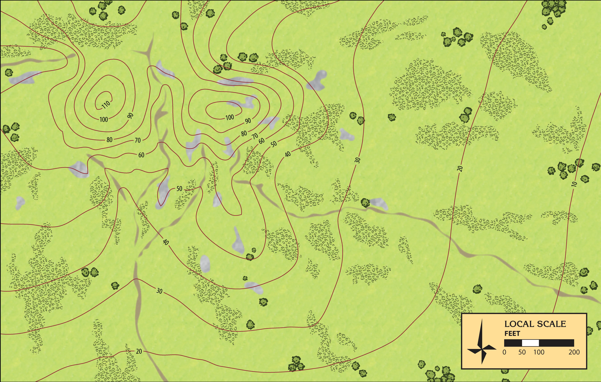
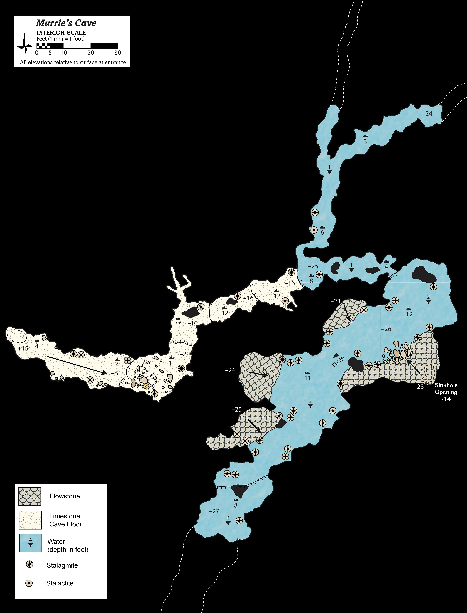
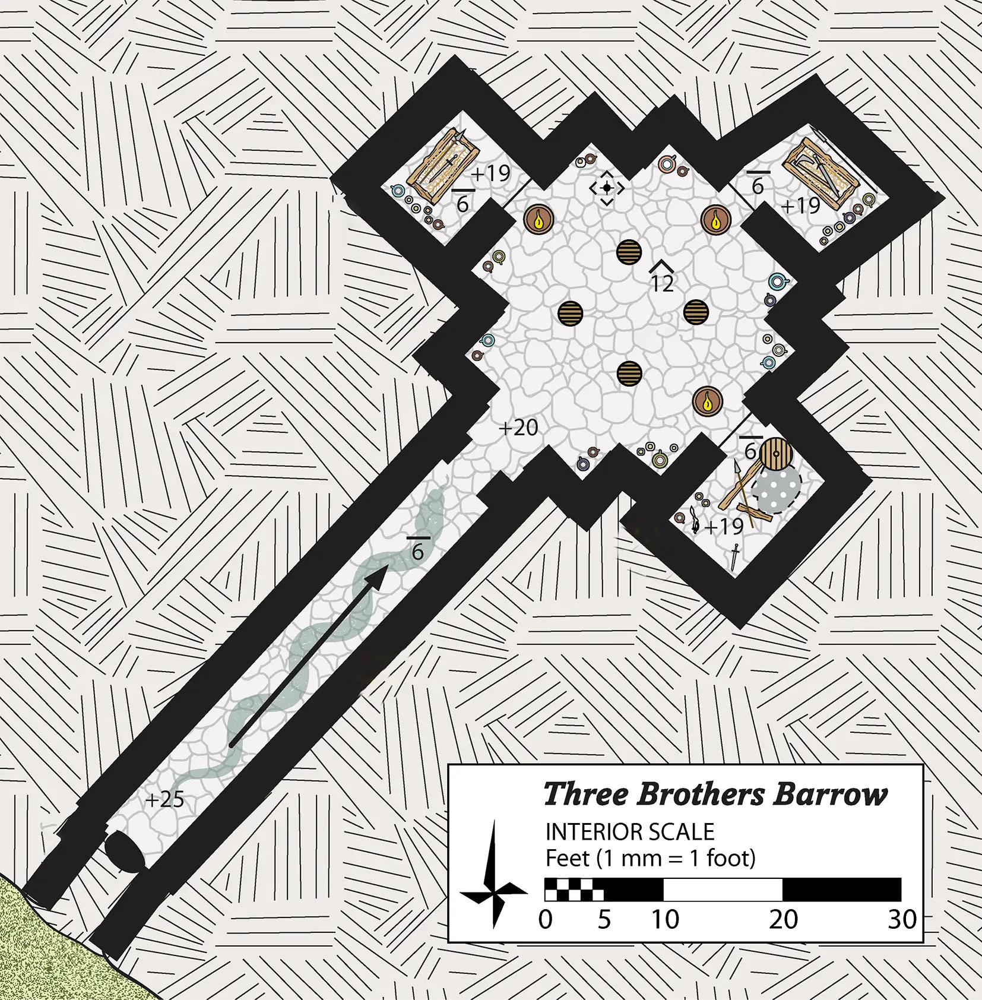

# HârnWorld Location Module: Three Brothers Barrow

Three Brothers Barrow is a "Location Module" for the Foundry VTT system. It is designed to provide
a ready-made Jarin barrow tomb for heroes to explore, along with several adventure hooks. 
This location module is designed for the [HârnWorld](https://columbiagames.com/harnworld/)
fantasy setting; however, this barrowcould be adapted to exist anywhere in any fantasy setting.

Although designed for use with the [HârnMaster](https://foundryvtt.com/packages/hm3)
system, this module is mostly system-agnostic, with the exception of Actors (a monster).
Detailed descriptions of the actors has been provided in journal entries to facilitate
conversion to other game systems.

# Maps

The original maps from this work have been used as inspiration, and new maps have been
designed specifically to meet the requirements of the VTT environment.  The following
maps are part of this module.

## General Area

Map of General Area around Three Brothers' Barrow

## Cave

## Tomb

# Credits

This module is made possible by the hard work of HârnWorld fans,
and is provided at no cost. This work is an adaptation of the article
[Three Brothers Barrow](https://www.lythia.com/adventures/three-brothers-barrow/) available
at the HârnWorld fan site [Lythia.com](https://www.lythia.com/).

**Writer:** Rob Barnes

**Original Maps:** Rob Barnes

**Artist:** Richard Luschek

**Adapted to Foundry VTT:** Tom Rodriguez

This module is "[Fanon](https://www.lythia.com/about/publishing-fan-written-material/)",
a derivative work of copyrighted material by Columbia Games Inc. and N. Robin Crossby.

Some assets used to create the maps in this module are from
[Forgotton Adventures](https://www.forgotten-adventures.net/).
